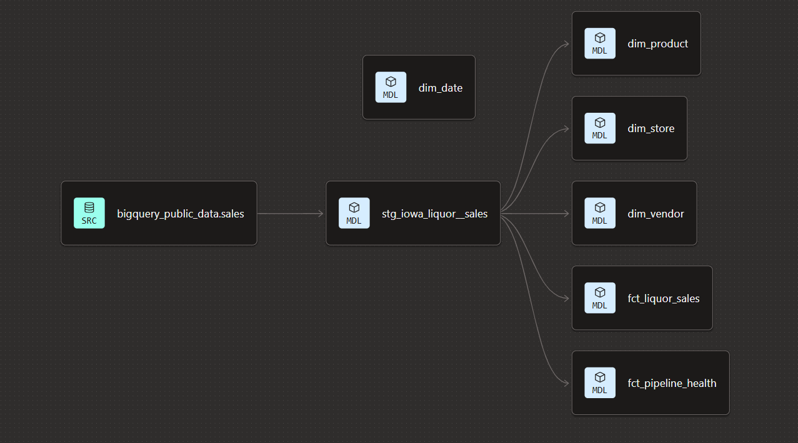

# Iowa Liquor Sales Analytics

> End-to-end Analytics Engineering showcase demonstrating modern data modeling, transformation, testing, and reporting using dbt and Google BigQuery.

---

# Project Overview

This project transforms the public **Iowa Liquor Sales** dataset into an analytics-ready data warehouse using a layered dbt architecture.

The objective is to demonstrate Analytics Engineering best practices by designing a maintainable star schema, 
implementing automated data quality tests, and delivering business-ready datasets for reporting in Google Looker Studio.

The final solution follows a modern ELT workflow:

```
Google BigQuery Public Dataset
            │
            ▼
      Source Layer
            │
            ▼
      Staging Models
            │
            ▼
     Star Schema (Marts)
            │
            ▼
      Looker Dashboard
```

## dbt DAG

<br> The following graph shows the lineage of the dbt models used in this project.



<br> 

# Objectives

This showcase demonstrates how to:

- Design a dimensional data model
- Build scalable dbt projects
- Apply modern Analytics Engineering practices
- Create reusable fact and dimension tables
- Implement automated data quality testing
- Produce analytics-ready datasets for business intelligence
- Document data models using dbt YAML metadata


# Dataset

**Source**

Google BigQuery Public Dataset

```
bigquery-public-data.iowa_liquor_sales.sales
```

The dataset contains historical wholesale liquor transactions between the State of Iowa and licensed retail stores.

Each record represents a single invoice line item including information about:

- Store
- Product
- Vendor
- Sales Amount
- Bottle Volume
- Transaction Date

---

# Architecture

The project follows a layered dbt architecture.

```
models/

├── 1_staging
│
└── 2_marts
```
Note: The intermediate layer was dropped as it is not required for this particular showcase.

### Staging Layer

The staging layer standardizes the raw source data by:

- Renaming columns
- Applying data types
- Removing inconsistencies
- Creating reusable source models

---

### Mart Layer

The mart layer exposes a dimensional model optimized for analytics and reporting.

```
                dim_date
                   │
                   │
dim_store ─── fct_liquor_sales ─── dim_product
                   │
                   │
               dim_vendor    
```

---

# Data Model

## Fact Table

### fct_liquor_sales

The central fact table contains one record per wholesale liquor sales line item.

### Grain

> One row per invoice line item.

### Key Measures

- Wholesale Revenue
- Wholesale Profit
- Estimated Retail Revenue
- Bottles Sold
- Volume Sold (Liters)

---

## Dimensions

### dim_date

Reusable calendar dimension supporting time intelligence.

Example attributes include:

- Year
- Quarter
- Month
- Week
- Day
- Weekend Indicator

---

### dim_store

Store dimension containing descriptive and aggregated information for every retail location.

Includes:

- Geographic attributes
- Lifetime revenue
- Total orders
- Customer tier
- Store activity status

---

### dim_product

Product dimension containing descriptive information about each liquor product.

Includes:

- Product description
- Product category
- Bottle volume
- Bottles per case

To ensure one record per product, changing product descriptions in the source data are resolved 
by retaining the latest known descriptive attributes based on the most recent transaction.

---

### Pipeline Monitoring

The project also includes a dedicated monitoring model.

#### fct_pipeline_health

Tracks operational metrics including:

- Source freshness
- Rows processed
- Missing categories
- Missing stores
- Invalid sales values

This model demonstrates how operational metadata can be modeled alongside business data.

---

# Data Quality

The project uses dbt tests to validate model integrity.

Current tests include:

- Primary key uniqueness
- Not Null constraints
- Referential integrity

---

# Dashboard

The mart layer is designed specifically for reporting in **Google Looker Studio**.

The dashboard will include:

- Executive KPI overview
- Revenue trends
- Profit analysis
- Product performance
- Store performance
- Geographic sales distribution
- Interactive filtering

---

# Skills Demonstrated

## Analytics Engineering

- dbt
- SQL
- BigQuery
- ELT Pipelines
- Modular Data Modeling
- Star Schema Design
- Dimensional Modeling

## Data Quality

- Automated Testing
- YAML Documentation
- Data Validation
- Pipeline Monitoring

## Analytics

- KPI Design
- Business Metrics
- Revenue Analysis
- Profit Analysis
- Geographic Analysis

## Software Engineering

- Git
- GitHub
- Version Control
- Reproducible Development

# Project Status

**Status:** 🚧 Active Development
